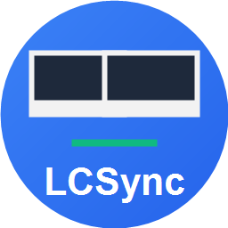

# LCSync 实验室中心联屏系统



## 系统要求

### 最低要求
- **操作系统**：Windows 7 SP1 或更高版本（包含 Windows 10/11）
- **内存**：2GB RAM（推荐 4GB）
- **.NET Framework**：4.7.2 或更高版本（通常已预装）
- **网络**：局域网连接（支持跨网段）

### 推荐配置
- **操作系统**：Windows 10 或 Windows 11
- **内存**：4GB RAM 或更高
- **网络**：100Mbps 局域网

## 功能特性

### 教师端
- 屏幕广播（支持多种画质选择）
- 画质预设：极低画质/360P/480P/720P/1080P
- 实时帧率、码率监控
- 支持 100+ 学生并发连接
- 自动申请管理员权限（用于屏幕捕获）

### 学生端
- 输入教师 IP 地址连接
- 全屏/窗口模式切换
- 断开连接自动退出全屏
- 实时接收视频流
- 显示已接收帧数和流量统计

### 画质选择建议

| 画质 | 分辨率 | 帧率 | 码率 | 适用场景 |
|------|--------|------|------|----------|
| 极低画质 | 640x360 | 10fps | ~300kbps | 云桌面/极低带宽 |
| 360P 低码率 | 640x360 | 15fps | ~500kbps | 受限网络 |
| 480P 标清 | 854x480 | 15fps | ~800kbps | 普通网络 |
| **720P 高清（推荐）** | 1280x720 | 20fps | ~1.5Mbps | 良好网络 |
| 720P 超清 | 1280x720 | 25fps | ~2.5Mbps | 优质网络 |
| 1080P 全高清 | 1920x1080 | 24fps | ~4Mbps | 高质量要求 |

## 使用方法

### 教师端使用
1. 运行 LCSync.exe
2. 选择「教师模式」
3. 选择合适的画质预设（默认 720P 高清）
4. 点击「开始广播」
5. 告知学生您的 IP 地址（界面上会显示）

### 学生端使用
1. 运行 LCSync.exe
2. 选择「学生模式」
3. 输入教师端的 IP 地址
4. 点击「连接」
5. 等待视频画面显示
6. 点击「全屏」按钮可进入全屏模式

## 跨网段使用

如果学生端和教师端不在同一网段：
1. 确保网络设备（路由器/防火墙）允许 TCP 连接
2. 默认端口：9456
3. 如果连接慢，尝试降低画质设置
4. 首次运行会自动添加防火墙规则

## 常见问题

### Q: 学生端连接后没有画面？
A: 检查：
- 教师端是否已开始广播
- 网络是否连通（ping 教师IP）
- 防火墙是否放行 9456 端口
- 是否在同一网段（跨网段可能需要额外配置）

### Q: 画面卡顿？
A: 尝试：
- 降低画质设置（推荐 480P 或更低）
- 检查网络带宽
- 减少同时观看人数
- 关闭其他占用网络带宽的应用

### Q: 无法启动或提示权限不足？
A: 尝试：
- 右键点击 LCSync.exe，选择「以管理员身份运行」
- 或在 UAC 提示时点击「是」允许权限提升

### Q: Windows 7 运行异常？
A: 确保：
- 安装了 Windows 7 SP1
- 安装了 .NET Framework 4.7.2
- 以管理员身份运行

## 技术栈

- **框架**：.NET Framework 4.7.2
- **UI**：WPF (Windows Presentation Foundation)
- **通信**：WebSocketSharp（WebSocket 通信）
- **编码**：JPEG 图像压缩
- **MVVM**：自定义 ViewModelBase + RelayCommand

## 项目结构

```
LCSync/
├── assets/          # 资源文件（图标等）
├── scripts/         # 辅助脚本
├── src/
│   └── LCSync.App/  # WPF 应用主程序
│       ├── Models/       # 数据模型
│       ├── Services/     # 服务层
│       ├── ViewModels/   # 视图模型
│       ├── Views/        # UI 视图
│       └── Utils/        # 工具类
├── publish/         # 发布目录
└── LCSync.sln      # 解决方案文件
```

## 更新日志

### v1.1.0（最新）
- ✅ 添加软件图标
- ✅ 优化屏幕捕获性能
- ✅ 优化内存分配，减少 GC 压力
- ✅ 修复 Win7 兼容性问题
- ✅ 使用 WebSocketSharp 替代内置 WebSocket
- ✅ 各画质预设优化 JPEG 质量
- ✅ 清理未使用的依赖（移除 MessagePack）

### v1.0.0
- ✅ 初始版本发布
- ✅ 教师端屏幕广播
- ✅ 学生端视频接收
- ✅ 多画质选择
- ✅ 全屏模式
- ✅ 跨网段支持

## 技术支持

如有问题，请联系技术支持团队。
